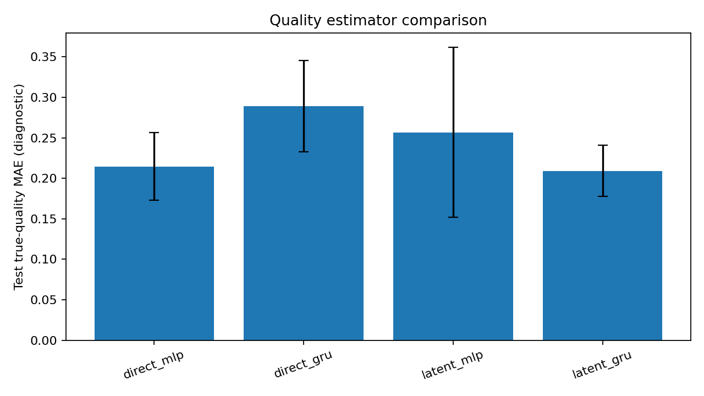

# 実験メモ

実験して気になった所だけ残している。

## v5、v6

Direct、Latent、Fusionを比べた。Directの誤差が小さく、潜在表現を作るだけでは良くならなかった。

v5とv6は似ているが、途中の版として両方残している。

## v13

品質ラベル50点、5 seedでDirect GRUとLatent GRUを比較した。

| モデル | 真値MAEの平均 |
|---|---:|
| Direct GRU | 0.288907 |
| Latent GRU | 0.209173 |

Latent GRUが5 seedとも小さくなった。ただ、GRUだけの比較である。

元データは[`05_labels.csv`](../results/v13/representation/05_labels.csv)である。

## v14

MLPも追加した。

| モデル | 真値MAEの平均 |
|---|---:|
| Direct MLP | 0.214543 |
| Direct GRU | 0.288907 |
| Latent MLP | 0.256630 |
| Latent GRU | 0.209173 |

Latent GRUとDirect MLPはかなり近い。seedごとではLatent GRUが2回、Direct MLPが3回良くなった。

元データは[`raw_results.csv`](../results/v14/raw_results.csv)である。

## 状態の再計算

遅れて届いた品質に合わせて過去の潜在状態を直し、現在まで計算し直した。

oracleでは少し良くなったが、出力誤差を足すだけの方法がかなり強い結果だった。今のシミュレーターだと、状態を直す必要性があまり出ていないようだ。

元データは[`01_necessity_raw.csv`](../results/resync_v2/necessity/01_necessity_raw.csv)である。

次は、欠測や別の外乱も試したい。
